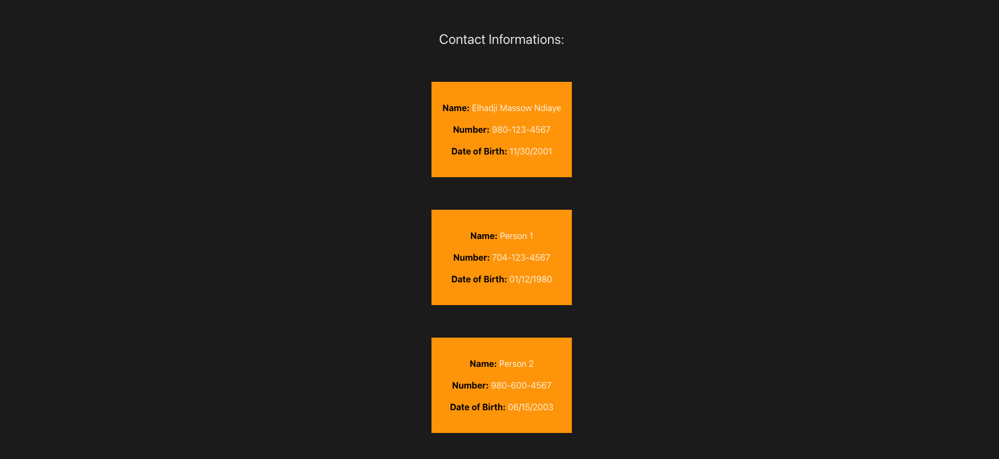

# React Contacts Information App

A simple React application that displays basic information for one or more people. This project is designed to teach the fundamentals of **React class components, state management, and rendering lists dynamically**.

---

## Assignment Overview

### VERY EASY

Inside the `App` class's `render` method, return a `div` with hard-coded basic information such as name, number, and date of birth. This prepares the project for the Medium challenge.

### EASY

Create a `constructor` in the `App` class that takes `props`, call `super(props)`, and set `this.state` to an empty object. Then create a `person` property inside `this.state` and set it to an empty object.

### MEDIUM

Replace all the hard-coded data with data from `this.state.person` in the constructor. Then take the returned `div` and create a component, passing state into it. Import this component as `BasicInfo`. The page layout should remain the same.

### HARD

Modify the app to iterate over an **array of people’s information** while keeping the list in the top-level state.  
**Optional:** Add styling to space out each person’s information and include hover animations for a modern UI.

---

## Features

- Display a person’s basic information (Name, Phone, Date of Birth)
- Render a list of multiple persons dynamically using React `map()`
- Styled contact cards with spacing, rounded corners, and hover animations
- Clean separation of components using `BasicInfo` for individual contacts

---

## Technologies Used

- **React** (Class components, state, props)
- **JavaScript** (Array iteration, dynamic rendering)
- **HTML5 & CSS3** (Styling, layout, hover animations)
- **Vite** (React project setup and development server)

---

## Installation & Usage

1. Clone the repository: git clone git@github.com:MassowNdiaye/React-GI---1-.git

2. Install dependencies: npm install

3. Start the development server: npm run dev
